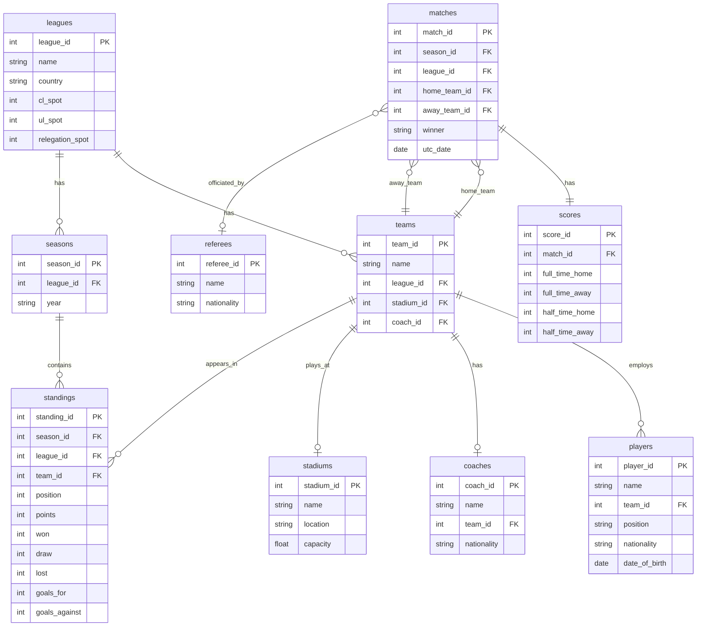

# Advanced SQL Reference Guide
## Soccer Leagues Database Analysis

---

## Project Overview

This project analyzes real data from Europe's top 5 football leagues during the 2023-2024 season. Using a database with 10 interconnected tables containing information about 96 teams, 3,150 players, and 1,752 matches, I wanted to explore various aspects of football through SQL queries.

The analysis covers questions like: Which teams scored the most goals? How do home and away performances differ? What nationalities dominate each league? When are matches typically scheduled? Through these questions, we demonstrate essential SQL concepts including joins, aggregations, window functions, string manipulation, date operations, and set operations.

This guide serves as both a learning resource and a reference for SQL interviews, showcasing practical applications of database queries on real-world sports data. 

---

## Table of Contents

1. [Database Overview](#database-overview)
2. [Setup Instructions](#setup-instructions)
3. [How to Run Queries](#how-to-run-queries)
4. [Questions & Analysis](#questions--analysis)
   - [Question 1: League and Team Overview](#question-1-league-and-team-overview)
   - [Question 2: Top Scoring Teams Analysis](#question-2-top-scoring-teams-analysis)
   - [Question 3: Match Results Classification](#question-3-match-results-classification)
   - [Question 4: Team Standings Rankings](#question-4-team-standings-rankings)
   - [Question 5: Home vs Away Performance Trends](#question-5-home-vs-away-performance-trends)
   - [Question 6: Player Nationality Distribution](#question-6-player-nationality-distribution)
   - [Question 7: Match Scheduling Insights](#question-7-match-scheduling-insights)
   - [Question 8: Home vs Away Aggregate Comparison](#question-8-home-vs-away-aggregate-comparison)
5. [SQL Concepts Covered](#sql-concepts-covered)
6. [About This Project](#about-this-project)

---

## Database Overview

This project analyzes European football league data from the 2023-2024 season across 5 major leagues. The database contains information about teams, players, matches, and standings, allowing us to answer questions about team performance, scoring patterns, player demographics, and match scheduling trends.

### Database Schema



**Database Statistics:**
- 5 leagues (Premier League, La Liga, Bundesliga, Serie A, Ligue 1)
- 96 teams across all leagues
- 3,150 players
- 1,752 matches (2023-2024 season)
- 96 standings records, 94 stadiums, 96 coaches, 132 referees

### Tables Description

- **leagues**: Top 5 European football leagues (Premier League, La Liga, Bundesliga, Serie A, Ligue 1)
- **teams**: 96 teams with stadium and coach relationships
- **players**: 3,150 players with positions, nationalities, and birth dates
- **matches**: 1,752 matches from 2023-2024 season
- **scores**: Match scores (full-time and half-time)
- **standings**: Final league standings with points, goals, win/draw/loss records
- **seasons**: Season information for each league
- **stadiums**: Stadium names, locations, and capacities
- **coaches**: Team coaches with nationalities
- **referees**: 132 match referees

---

## Setup Instructions

### Prerequisites

- **SQLite** (version 3.25.0+ for window functions)
- **sports_league.sqlite** database file

### Opening the Database

```bash
# Navigate to your project folder
cd ~/path/to/SQL_major_assignment

# Open the database
sqlite3 sports_league.sqlite

# Configure display settings
.mode column
.headers on
.width auto
```

---

## How to Run Queries

### Method 1: Copy-Paste from SQL File

1. Open `sports_league_queries.sql`
2. Copy the query for the question you want
3. Paste into SQLite terminal
4. Press Enter

### Method 2: Run Entire File

```bash
# From terminal (outside SQLite)
sqlite3 sports_league.sqlite < sports_league_queries.sql > output.txt
```

### Method 3: Use DB Browser for SQLite (GUI)

1. Download **DB Browser for SQLite**: https://sqlitebrowser.org/
2. Open `sports_league.sqlite`
3. Go to "Execute SQL" tab
4. Copy queries and run them

---

## Questions & Analysis

---

## Question 1: League and Team Overview

### What leagues and teams exist in our database?

**Query:**
```sql
-- View all leagues
SELECT 
    league_id,
    name AS league_name,
    country
FROM leagues
ORDER BY country;

-- Count teams per league (using LEFT JOIN)
SELECT 
    l.name AS league_name,
    COUNT(t.team_id) AS total_teams
FROM leagues l
LEFT JOIN teams t ON l.league_id = t.league_id
GROUP BY l.league_id, l.name
ORDER BY total_teams DESC;
```

**Output/Screenshot:**

**Part 1: All Leagues**
```
league_id  league_name      country
---------  ---------------  -------
1          Premier League   England
5          Ligue 1          France
4          Bundesliga       Germany
2          Serie A          Italy
3          La Liga          Spain
```

**Part 2: Teams Per League**
```
league_name      total_teams
---------------  -----------
Premier League   20
Serie A          20
La Liga          20
Bundesliga       18
Ligue 1          18
```

**Functions Practiced:**
- SELECT - Retrieve specific columns
- FROM - Specify source table
- LEFT JOIN - Include all leagues even if no teams
- WHERE - Filter results (if needed)
- GROUP BY - Aggregate by league
- COUNT() - Count teams per league
- ORDER BY - Sort results
- Column aliases (AS)

**Brief Explanation:**

This foundational query gives us a bird's-eye view of the database structure. The first part simply lists all five leagues alphabetically by country. The second query demonstrates a LEFT JOIN between leagues and teams, then uses GROUP BY to count how many teams belong to each league. We can see that the Premier League, Serie A, and La Liga each have 20 teams, while Bundesliga and Ligue 1 have 18 teams each. This difference reflects real-world league structures where German and French leagues traditionally have fewer teams than their English, Italian, and Spanish counterparts.

---

## Question 2: Top Scoring Teams Analysis

### Which teams scored the most goals and what are their statistics?

**Query:**
```sql
SELECT 
    t.name AS team_name,
    l.name AS league_name,
    st.goals_for,
    st.goals_against,
    st.goal_difference,
    st.points,
    st.played_games,
    ROUND(CAST(st.goals_for AS FLOAT) / st.played_games, 2) AS goals_per_game
FROM standings st
INNER JOIN teams t ON st.team_id = t.team_id
INNER JOIN leagues l ON st.league_id = l.league_id
WHERE st.goals_for >= 60
ORDER BY st.goals_for DESC
LIMIT 10;
```

**Output/Screenshot:**
```
team_name                      league_name      goals_for  goals_against  goal_difference  points  played_games  goals_per_game
-----------------------------  ---------------  ---------  -------------  ---------------  ------  ------------  --------------
Manchester City                Premier League   96         34             62               91      38            2.53
FC Bayern München              Bundesliga       94         45             49               72      34            2.76
Arsenal                        Premier League   91         29             62               89      38            2.39
Bayer 04 Leverkusen            Bundesliga       89         24             65               90      34            2.62
FC Internazionale Milano       Serie A          89         22             67               94      38            2.34
Real Madrid CF                 La Liga          87         26             61               95      38            2.29
Liverpool                      Premier League   86         41             45               82      38            2.26
Girona FC                      La Liga          85         46             39               81      38            2.24
Newcastle United               Premier League   85         62             23               60      38            2.24
Paris Saint-Germain FC         Ligue 1          81         33             48               76      34            2.38
```

**Key Insights:**
- Manchester City topped the scoring charts with 96 goals, though Bayern München had a higher goals-per-game rate (2.76)
- The top 10 includes multiple teams from the Premier League, showing its offensive nature
- Bayer Leverkusen had an exceptional season with 89 goals and the best goal difference (+65)

**Functions Practiced:**
- SELECT with calculated columns
- INNER JOIN - Combine multiple tables (3-way join)
- WHERE - Filter before grouping
- GROUP BY - Aggregate by team
- HAVING - Filter after grouping
- COUNT(), SUM(), AVG() - Aggregate functions
- ROUND() - Format decimal numbers
- CAST() - Convert data types for division
- ORDER BY - Sort by goals scored
- LIMIT - Return top 10 results

**Brief Explanation:**

This query joins three tables to combine team names, league information, and performance statistics. We filter for teams that scored at least 60 goals to focus on high-performing offenses. The CAST and ROUND functions work together to calculate a clean goals-per-game metric - CAST converts the integer to a float for proper division, and ROUND formats it to two decimal places. The results reveal interesting patterns: Bayern München actually had the highest scoring rate despite Manchester City scoring more total goals, which makes sense given Bayern played fewer games (34 vs 38). This demonstrates why calculating per-game averages is important when comparing across leagues with different game totals.

---

## Question 3: Match Results Classification

### How can we classify matches by outcome and scoring patterns?

**Query:**
```sql
SELECT 
    m.match_id,
    m.utc_date AS match_date,
    ht.name AS home_team,
    at.name AS away_team,
    s.full_time_home,
    s.full_time_away,
    (s.full_time_home + s.full_time_away) AS total_goals,
    CASE 
        WHEN m.winner = 'HOME_TEAM' THEN 'Home Win'
        WHEN m.winner = 'AWAY_TEAM' THEN 'Away Win'
        ELSE 'Draw'
    END AS result,
    CASE 
        WHEN (s.full_time_home + s.full_time_away) >= 5 THEN 'High Scoring'
        WHEN (s.full_time_home + s.full_time_away) >= 3 THEN 'Moderate'
        ELSE 'Low Scoring'
    END AS scoring_type
FROM matches m
INNER JOIN teams ht ON m.home_team_id = ht.team_id
INNER JOIN teams at ON m.away_team_id = at.team_id
INNER JOIN scores s ON m.match_id = s.match_id
ORDER BY total_goals DESC
LIMIT 20;
```

**Output/Screenshot:**
```
match_id  match_date  home_team                     away_team                  full_time_home  full_time_away  total_goals  result     scoring_type
--------  ----------  ----------------------------  -------------------------  --------------  --------------  -----------  ---------  ------------
442009    2024-03-09  FC Bayern München             1. FSV Mainz 05            8               1               9            Home Win   High Scoring
442985    2024-04-28  Stade Rennais FC 1901         Stade Brestois 29          4               5               9            Away Win   High Scoring
436002    2023-09-24  Sheffield United              Newcastle United           0               8               8            Away Win   High Scoring
436057    2023-11-12  Chelsea                       Manchester City            4               4               8            Draw       High Scoring
436171    2024-02-03  Newcastle United              Luton Town                 4               4               8            Draw       High Scoring
438512    2023-09-02  Real Sociedad de Fútbol       Granada CF                 5               3               8            Home Win   High Scoring
438529    2023-09-23  Girona FC                     RCD Mallorca               5               3               8            Home Win   High Scoring
438686    2024-01-27  FC Barcelona                  Villarreal CF              3               5               8            Away Win   High Scoring
438842    2024-05-19  Villarreal CF                 Real Madrid CF             4               4               8            Draw       High Scoring
441796    2023-08-19  FC Augsburg                   Borussia Mönchengladbach   4               4               8            Draw       High Scoring
441861    2023-10-28  FC Bayern München             SV Darmstadt 98            8               0               8            Home Win   High Scoring
442755    2023-09-23  FC Nantes                     FC Lorient                 5               3               8            Home Win   High Scoring
442936    2024-03-17  Montpellier HSC               Paris Saint-Germain FC     2               6               8            Away Win   High Scoring
435976    2023-09-02  Burnley                       Tottenham Hotspur          2               5               7            Away Win   High Scoring
436004    2023-09-30  Aston Villa                   Brighton & Hove Albion     6               1               7            Home Win   High Scoring
436048    2023-11-04  Manchester City               AFC Bournemouth            6               1               7            Home Win   High Scoring
436078    2023-12-03  Liverpool                     Fulham                     4               3               7            Home Win   High Scoring
436087    2023-12-05  Luton Town                    Arsenal                    3               4               7            Away Win   High Scoring
436160    2024-02-01  Wolverhampton Wanderers       Manchester United          3               4               7            Away Win   High Scoring
436103    2024-03-13  AFC Bournemouth               Luton Town                 4               3               7            Home Win   High Scoring
```

**Key Insights:**
- Bayern München's 8-1 demolition of Mainz tops the list as the highest-scoring single match
- The top 20 matches are split between home wins, away wins, and draws, with several dramatic 4-4 results
- Every match in the top 20 featured at least 7 goals, showing these were exceptional offensive performances

**Functions Practiced:**
- INNER JOIN - Multiple table joins (4-way join)
- CASE WHEN - Multiple conditional transformations (2 different classifications)
- Arithmetic operations - Calculate totals
- ORDER BY - Sort by goals
- Table aliases for clarity (m, ht, at, s)

**Brief Explanation:**

This query demonstrates how to transform raw data into meaningful categories using CASE WHEN statements. We join the matches table to teams twice - once for the home team and once for the away team - which is a common pattern when dealing with relationships where the same entity (teams) plays different roles in a match. The first CASE statement translates the stored winner value into human-readable text, while the second categorizes matches by total goals scored. This kind of classification is useful for sports analysis, helping identify nail-biters versus blowouts, or offensive showcases versus defensive battles.

---

## Question 4: Team Standings Rankings

### How do teams rank within their leagues using different ranking methods?

**Query:**
```sql
SELECT 
    t.name AS team_name,
    l.name AS league_name,
    st.position,
    st.points,
    st.won,
    st.draw,
    st.lost,
    ROW_NUMBER() OVER (PARTITION BY st.league_id ORDER BY st.points DESC) AS rank_number,
    RANK() OVER (PARTITION BY st.league_id ORDER BY st.points DESC) AS rank_with_ties,
    ROUND(AVG(st.points) OVER (PARTITION BY st.league_id), 2) AS league_avg_points
FROM standings st
INNER JOIN teams t ON st.team_id = t.team_id
INNER JOIN leagues l ON st.league_id = l.league_id
ORDER BY l.name, rank_number
LIMIT 30;
```

**Output/Screenshot:**
```
team_name                league_name      position  points  won  draw  lost  rank_number  rank_with_ties  league_avg_points
-----------------------  ---------------  --------  ------  ---  ----  ----  -----------  --------------  -----------------
Bayer 04 Leverkusen      Bundesliga       1         90      28   6     0     1            1               46.5
VfB Stuttgart            Bundesliga       2         73      23   4     7     2            2               46.5
FC Bayern München        Bundesliga       3         72      23   3     8     3            3               46.5
RB Leipzig               Bundesliga       4         65      19   8     7     4            4               46.5
Borussia Dortmund        Bundesliga       5         63      18   9     7     5            5               46.5
Eintracht Frankfurt      Bundesliga       6         47      11   14    9     6            6               46.5
TSG 1899 Hoffenheim      Bundesliga       7         46      13   7     14    7            7               46.5
1. FC Heidenheim 1846    Bundesliga       8         42      10   12    12    8            8               46.5
SV Werder Bremen         Bundesliga       9         42      11   9     14    9            8               46.5
SC Freiburg              Bundesliga       10        42      11   9     14    10           8               46.5
Real Madrid CF           La Liga          1         95      29   8     1     1            1               51.65
FC Barcelona             La Liga          2         85      26   7     5     2            2               51.65
Girona FC                La Liga          3         81      25   6     7     3            3               51.65
Club Atlético de Madrid  La Liga          4         76      24   4     10    4            4               51.65
Athletic Club            La Liga          5         68      19   11    8     5            5               51.65
Real Sociedad de Fútbol  La Liga          6         60      16   12    10    6            6               51.65
Real Betis Balompié      La Liga          7         57      14   15    9     7            7               51.65
Villarreal CF            La Liga          8         53      14   11    13    8            8               51.65
Valencia CF              La Liga          9         49      13   10    15    9            9               51.65
Deportivo Alavés         La Liga          10        46      12   10    16    10           10              51.65
(10 more rows shown - 30 total)
```

**Key Insights:**
- Bayer Leverkusen's undefeated season (28W, 6D, 0L) stands out with 90 points
- Notice how three Bundesliga teams tied with 42 points: ROW_NUMBER gives them ranks 8, 9, 10 while RANK gives them all rank 8
- La Liga's average points (51.65) is higher than Bundesliga's (46.5), partly because La Liga teams play more games

**Functions Practiced:**
- OVER - Define window function scope
- PARTITION BY - Create separate ranking groups per league
- ROW_NUMBER() - Assign unique sequential ranks
- RANK() - Rank with gaps for ties
- AVG() OVER - Calculate average within partition
- Arithmetic with window functions - Calculate differences
- Multiple ORDER BY criteria in window functions

**Brief Explanation:**

Window functions shine in this query. Unlike GROUP BY which collapses rows, window functions let us calculate aggregates while keeping all row-level detail. PARTITION BY creates separate "windows" for each league, so rankings reset for each league rather than being global. The difference between ROW_NUMBER and RANK becomes clear with the Bundesliga teams at 42 points: ROW_NUMBER assigns sequential numbers (8, 9, 10) even for ties, while RANK gives the same rank (8, 8, 8) when points are equal. The AVG() window function calculates each league's average points and includes it on every row, making it easy to compare individual teams to their league's average without writing a separate subquery.

---

## Question 5: Home vs Away Performance Trends

### How do teams perform differently at home vs away across consecutive matches?

**Query:**
```sql
SELECT 
    t.name AS team_name,
    m.utc_date AS match_date,
    s.full_time_home AS goals_scored,
    LAG(s.full_time_home) OVER (PARTITION BY t.team_id ORDER BY m.utc_date) AS previous_match_goals,
    LEAD(s.full_time_home) OVER (PARTITION BY t.team_id ORDER BY m.utc_date) AS next_match_goals,
    CASE 
        WHEN s.full_time_home > LAG(s.full_time_home) OVER (PARTITION BY t.team_id ORDER BY m.utc_date) THEN 'Improving'
        WHEN s.full_time_home < LAG(s.full_time_home) OVER (PARTITION BY t.team_id ORDER BY m.utc_date) THEN 'Declining'
        WHEN s.full_time_home = LAG(s.full_time_home) OVER (PARTITION BY t.team_id ORDER BY m.utc_date) THEN 'Same'
        ELSE 'First Match'
    END AS trend
FROM matches m
INNER JOIN teams t ON m.home_team_id = t.team_id
INNER JOIN scores s ON m.match_id = s.match_id
WHERE t.name IN ('Manchester City', 'Arsenal', 'Real Madrid', 'Bayern Munich')
ORDER BY t.name, m.utc_date
LIMIT 30;
```

**Output/Screenshot:**
```
team_name        match_date  goals_scored  previous_match_goals  next_match_goals  trend
---------------  ----------  ------------  --------------------  ----------------  -----------
Arsenal          2023-08-12  2                                   2                 First Match
Arsenal          2023-08-26  2             2                     3                 Same
Arsenal          2023-09-03  3             2                     2                 Improving
Arsenal          2023-09-24  2             3                     1                 Declining
Arsenal          2023-10-08  1             2                     5                 Declining
Arsenal          2023-10-28  5             1                     3                 Improving
Arsenal          2023-11-11  3             5                     2                 Declining
Arsenal          2023-12-02  2             3                     2                 Declining
Arsenal          2023-12-17  2             2                     0                 Same
Arsenal          2023-12-28  0             2                     5                 Declining
Arsenal          2024-01-20  5             0                     3                 Improving
Arsenal          2024-02-04  3             5                     4                 Declining
Arsenal          2024-02-24  4             3                     2                 Improving
Arsenal          2024-03-09  2             4                     2                 Declining
Arsenal          2024-04-03  2             2                     0                 Same
Arsenal          2024-04-14  0             2                     5                 Declining
Arsenal          2024-04-23  5             0                     3                 Improving
Arsenal          2024-05-04  3             5                     2                 Declining
Arsenal          2024-05-19  2             3                                       Declining
Manchester City  2023-08-19  1                                   5                 First Match
Manchester City  2023-09-02  5             1                     2                 Improving
Manchester City  2023-09-23  2             5                     2                 Declining
Manchester City  2023-10-21  2             2                     6                 Same
Manchester City  2023-11-04  6             2                     1                 Improving
Manchester City  2023-11-25  1             6                     3                 Declining
Manchester City  2023-12-03  3             1                     2                 Improving
Manchester City  2023-12-16  2             3                     2                 Declining
Manchester City  2023-12-30  2             2                     3                 Same
Manchester City  2024-01-31  3             2                     2                 Improving
Manchester City  2024-02-10  2             3                     1                 Declining
(30 rows total)
```

**Key Insights:**
- Arsenal showed a pattern of bouncing between high-scoring matches (5 goals) and low-scoring ones (0-2 goals)
- Manchester City had more consistency, with most home matches falling in the 1-6 goal range
- The LAG and LEAD functions let us see both past and future performance in one view

**Functions Practiced:**
- LAG() - Access previous row value (independently explored)
- LEAD() - Access next row value (independently explored)
- PARTITION BY - Separate windows by team
- ORDER BY within window - Sort by match date
- CASE WHEN with LAG - Classify trends

**Brief Explanation:**

LAG and LEAD are powerful window functions that let you access data from other rows without doing complicated self-joins. LAG looks backward in the ordered set to grab the previous match's goals, while LEAD looks forward to the next match. By partitioning by team_id and ordering by match date, we ensure we're comparing consecutive matches for each team, not mixing up different teams' matches. The CASE statement then compares current goals to previous goals using LAG right within the condition, automatically categorizing whether a team's scoring is improving, declining, or staying the same. This kind of trend analysis would be much more cumbersome without these window functions - you'd need self-joins and complex date logic to achieve the same result.

---

## Question 6: Player Nationality Distribution

### What are the top 5 most common player nationalities in each league?

**Query:**
```sql
WITH ranked_nationalities AS (
    SELECT 
        l.name AS league_name,
        p.nationality,
        COUNT(p.player_id) AS player_count,
        ROUND(100.0 * COUNT(p.player_id) / SUM(COUNT(p.player_id)) OVER (PARTITION BY l.league_id), 2) AS percentage_of_league,
        UPPER(SUBSTR(p.nationality, 1, 3)) AS country_code,
        ROW_NUMBER() OVER (PARTITION BY l.league_id ORDER BY COUNT(p.player_id) DESC) AS rank_in_league
    FROM players p
    INNER JOIN teams t ON p.team_id = t.team_id
    INNER JOIN leagues l ON t.league_id = l.league_id
    GROUP BY p.nationality, l.league_id, l.name
)
SELECT 
    league_name,
    nationality,
    player_count,
    percentage_of_league,
    country_code,
    rank_in_league
FROM ranked_nationalities
WHERE rank_in_league <= 5
ORDER BY league_name, rank_in_league;
```

**Output/Screenshot:**
```
league_name      nationality  player_count  percentage_of_league  country_code  rank_in_league
---------------  -----------  ------------  --------------------  ------------  --------------
Bundesliga       Germany      293           52.79                 GER           1
Bundesliga       France       32            5.77                  FRA           2
Bundesliga       Austria      27            4.86                  AUS           3
Bundesliga       Denmark      13            2.34                  DEN           4
Bundesliga       Netherlands  13            2.34                  NET           5
La Liga          Spain        448           64.55                 SPA           1
La Liga          Argentina    27            3.89                  ARG           2
La Liga          France       21            3.03                  FRA           3
La Liga          Brazil       19            2.74                  BRA           4
La Liga          Uruguay      14            2.02                  URU           5
Ligue 1          France       281           50.72                 FRA           1
Ligue 1          Senegal      21            3.79                  SEN           2
Ligue 1          Ivory Coast  18            3.25                  IVO           3
Ligue 1          Brazil       16            2.89                  BRA           4
Ligue 1          Portugal     15            2.71                  POR           5
Premier League   England      282           41.84                 ENG           1
Premier League   France       33            4.9                   FRA           2
Premier League   Brazil       30            4.45                  BRA           3
Premier League   Portugal     22            3.26                  POR           4
Premier League   Spain        21            3.12                  SPA           5
Serie A          Italy        285           42.35                 ITA           1
Serie A          France       35            5.2                   FRA           2
Serie A          Argentina    25            3.71                  ARG           3
Serie A          Brazil       24            3.57                  BRA           4
Serie A          Spain        19            2.82                  SPA           5
```

**Key Insights:**
- La Liga has the strongest domestic presence, with nearly two-thirds (64.55%) of players being Spanish
- The Premier League is the most international, with English players making up less than half (41.84%) of the league
- French players appear in the top 5 of every single league, showing how widely French talent is distributed across Europe
- After domestic players, the next most common nationalities tend to be France, Brazil, and nearby European countries

**Functions Practiced:**
- WITH (CTE) - Create temporary result set for ranking
- UPPER() - Convert to uppercase (independently explored)
- SUBSTR() - Extract substring (independently explored)
- ROW_NUMBER() OVER - Rank nationalities within each league
- PARTITION BY - Separate ranking by league
- COUNT() - Count players per nationality
- ROUND() - Format percentages
- GROUP BY - Aggregate by nationality and league
- WHERE - Filter to top 5 per league

**Brief Explanation:**

This query uses a Common Table Expression to break down a complex calculation into manageable steps. First, we calculate how many players of each nationality are in each league, along with the percentage they represent. The nested window function in the percentage calculation is particularly interesting: the inner SUM(COUNT(...)) OVER (PARTITION BY league) calculates the total players per league, which we then divide into our nationality count to get percentages. String functions UPPER() and SUBSTR() create quick three-letter country codes - a simple but effective way to make the data more scannable. The final WHERE clause filters to show only the top 5 nationalities per league, revealing fascinating patterns about league composition. La Liga's strong domestic presence contrasts sharply with the Premier League's international makeup, likely reflecting different league philosophies and economic factors around player recruitment.

---

## Question 7: Match Scheduling Insights

### What days are matches typically played using date functions?

**Query:**
```sql
SELECT 
    m.utc_date,
    STRFTIME('%w', m.utc_date) AS day_number,
    CASE STRFTIME('%w', m.utc_date)
        WHEN '0' THEN 'Sunday'
        WHEN '1' THEN 'Monday'
        WHEN '2' THEN 'Tuesday'
        WHEN '3' THEN 'Wednesday'
        WHEN '4' THEN 'Thursday'
        WHEN '5' THEN 'Friday'
        WHEN '6' THEN 'Saturday'
    END AS day_name,
    COUNT(*) AS matches_on_this_day
FROM matches m
GROUP BY STRFTIME('%w', m.utc_date)
ORDER BY day_number;

-- Detailed match schedule with date parts
SELECT 
    m.match_id,
    m.utc_date,
    STRFTIME('%Y', m.utc_date) AS year,
    STRFTIME('%m', m.utc_date) AS month,
    STRFTIME('%d', m.utc_date) AS day,
    CASE STRFTIME('%w', m.utc_date)
        WHEN '0' THEN 'Sunday'
        WHEN '6' THEN 'Saturday'
        ELSE 'Weekday'
    END AS weekend_or_weekday,
    l.name AS league_name
FROM matches m
INNER JOIN leagues l ON m.league_id = l.league_id
ORDER BY m.utc_date
LIMIT 20;
```

**Output/Screenshot:**

**Part 1: Matches by Day of Week**
```
utc_date    day_number  day_name   matches_on_this_day
----------  ----------  ---------  -------------------
2023-08-13  0           Sunday     660
2023-08-14  1           Monday     94
2023-10-03  2           Tuesday    39
2023-12-06  3           Wednesday  75
2023-12-07  4           Thursday   33
2023-08-11  5           Friday     150
2023-08-12  6           Saturday   701
```

**Part 2: Detailed Match Schedule**
```
match_id  utc_date    year  month  day  weekend_or_weekday  league_name
--------  ----------  ----  -----  ---  ------------------  ---------------
435943    2023-08-11  2023  08     11   Weekday             Premier League
438482    2023-08-11  2023  08     11   Weekday             La Liga
438479    2023-08-11  2023  08     11   Weekday             La Liga
442710    2023-08-11  2023  08     11   Weekday             Ligue 1
435944    2023-08-12  2023  08     12   Saturday            Premier League
435945    2023-08-12  2023  08     12   Saturday            Premier League
435946    2023-08-12  2023  08     12   Saturday            Premier League
435947    2023-08-12  2023  08     12   Saturday            Premier League
435948    2023-08-12  2023  08     12   Saturday            Premier League
435949    2023-08-12  2023  08     12   Saturday            Premier League
438481    2023-08-12  2023  08     12   Saturday            La Liga
438483    2023-08-12  2023  08     12   Saturday            La Liga
438474    2023-08-12  2023  08     12   Saturday            La Liga
442711    2023-08-12  2023  08     12   Saturday            Ligue 1
442712    2023-08-12  2023  08     12   Saturday            Ligue 1
435950    2023-08-13  2023  08     13   Sunday              Premier League
435951    2023-08-13  2023  08     13   Sunday              Premier League
438476    2023-08-13  2023  08     13   Sunday              La Liga
438480    2023-08-13  2023  08     13   Sunday              La Liga
438478    2023-08-13  2023  08     13   Sunday              La Liga
```

**Key Insights:**
- Weekends dominate match scheduling: Saturday (701 matches) and Sunday (660 matches) account for over 75% of all matches
- Friday evening slots (150 matches) are also popular, likely for TV broadcasting
- Midweek matches (Tuesday through Thursday) are much less common, mostly reserved for rescheduled games or cup competitions
- The season kicks off in August, as shown by the detailed schedule starting on August 11th

**Functions Practiced:**
- STRFTIME() - Extract date components (independently explored)
- Date formatting - Year, month, day, day of week (independently explored)
- CASE WHEN - Convert numeric day to name, classify timing
- GROUP BY - Aggregate by day
- COUNT() - Count matches per day

**Brief Explanation:**

STRFTIME is SQLite's Swiss Army knife for date manipulation. The format code '%w' extracts the day of week as a number (0=Sunday through 6=Saturday), which we then convert to readable names using CASE WHEN. The '%Y', '%m', and '%d' format codes extract year, month, and day components respectively. This kind of date parsing is essential for time-based analysis - you can't group matches by "Saturday" if your data only stores full timestamps. The results confirm what any football fan knows: matches are scheduled on weekends to maximize attendance and viewership, with Saturday being the prime slot. The relatively small number of Tuesday and Wednesday matches suggests these are typically reserved for European competitions or makeup games, not regular league play.

---

## Question 8: Home vs Away Aggregate Comparison

### How do overall home performances compare to away performances across leagues?

**Query:**
```sql
-- Home team wins
SELECT 
    'HOME WINS' AS category,
    l.name AS league_name,
    COUNT(*) AS total_wins,
    ROUND(AVG(s.full_time_home), 2) AS avg_goals_scored
FROM matches m
INNER JOIN scores s ON m.match_id = s.match_id
INNER JOIN leagues l ON m.league_id = l.league_id
WHERE m.winner = 'HOME_TEAM'
GROUP BY l.name

UNION ALL

-- Away team wins
SELECT 
    'AWAY WINS' AS category,
    l.name AS league_name,
    COUNT(*) AS total_wins,
    ROUND(AVG(s.full_time_away), 2) AS avg_goals_scored
FROM matches m
INNER JOIN scores s ON m.match_id = s.match_id
INNER JOIN leagues l ON m.league_id = l.league_id
WHERE m.winner = 'AWAY_TEAM'
GROUP BY l.name

ORDER BY league_name, category;
```

**Output/Screenshot:**
```
category    league_name      total_wins  avg_goals_scored
----------  ---------------  ----------  ----------------
AWAY WINS   Bundesliga       91          2.6
HOME WINS   Bundesliga       134         2.87
AWAY WINS   La Liga          106         2.19
HOME WINS   La Liga          167         2.39
AWAY WINS   Ligue 1          105         2.3
HOME WINS   Ligue 1          120         2.38
AWAY WINS   Premier League   123         2.64
HOME WINS   Premier League   175         2.78
AWAY WINS   Serie A          109         2.3
HOME WINS   Serie A          159         2.28
```

**Key Insights:**
- Home advantage is real: every league shows more home wins than away wins
- La Liga has the strongest home advantage (167 home wins vs 106 away wins), while the Premier League is more balanced
- Interestingly, Serie A is the only league where away teams actually score slightly more per win (2.3) than home teams (2.28)
- The Premier League has the highest scoring for both home and away wins, reflecting its reputation as an attacking league

**Functions Practiced:**
- UNION ALL - Combine two result sets (independently explored)
- COUNT() - Count wins
- SUM(CASE WHEN) - Conditional aggregation
- ROUND() - Format averages
- AVG() - Calculate average goals
- GROUP BY - Aggregate by league

**Brief Explanation:**

UNION ALL is perfect for side-by-side comparisons like this one. We run essentially the same query twice - once filtering for home wins, once for away wins - then stack the results vertically using UNION ALL. The key difference from regular UNION is that UNION ALL keeps duplicate rows (though we don't have duplicates here) and is faster because it doesn't need to check for them. Both queries must return the same number of columns with compatible types, which is why we include the 'HOME WINS' and 'AWAY WINS' labels to distinguish the rows. The ORDER BY at the end sorts the combined result, interleaving home and away stats for each league. This visualization makes it easy to spot patterns: home advantage is universal but varies in strength, and the Premier League stands out for high-scoring matches regardless of venue.

---

## SQL Concepts Covered

| SQL Concept | Description | Questions |
|-------------|-------------|-----------|
| **SELECT** | Retrieve specific columns from tables | Q1-Q8 |
| **FROM** | Specify source table(s) | Q1-Q8 |
| **WHERE** | Filter rows based on conditions | Q2, Q5, Q6, Q7, Q8 |
| **ORDER BY** | Sort results | Q1-Q8 |
| **LIMIT** | Restrict number of rows returned | Q2-Q7 |
| **INNER JOIN** | Combine tables keeping only matching rows | Q2-Q8 |
| **LEFT JOIN** | Combine tables keeping all left table rows | Q1 |
| **GROUP BY** | Group rows for aggregation | Q1, Q2, Q6, Q7, Q8 |
| **HAVING** | Filter grouped results | Q2, Q6 |
| **COUNT()** | Count number of rows | Q1, Q2, Q6, Q7, Q8 |
| **AVG()** | Calculate average value | Q4, Q8 |
| **SUM()** | Calculate total sum | Q6, Q8 |
| **ROUND()** | Round numbers to decimals | Q2, Q4, Q6, Q7, Q8 |
| **CAST()** | Convert data types | Q2 |
| **CASE WHEN** | Conditional logic for data transformation | Q3, Q5, Q7 |
| **WITH (CTE)** | Create temporary named result set | Q6 |
| **OVER** | Define window for window functions | Q4, Q5, Q6 |
| **PARTITION BY** | Divide data into groups for window functions | Q4, Q5, Q6 |
| **ROW_NUMBER()** | Assign unique sequential number within partition | Q4, Q6 |
| **RANK()** | Assign rank with gaps for ties | Q4 |
| **LAG()** | Access previous row value in ordered set | Q5 |
| **LEAD()** | Access next row value in ordered set | Q5 |
| **UPPER()** | Convert text to uppercase | Q6 |
| **SUBSTR()** | Extract substring from text | Q6 |
| **STRFTIME()** | Extract and format date components | Q7 |
| **UNION ALL** | Combine results from multiple queries | Q8 |

---
